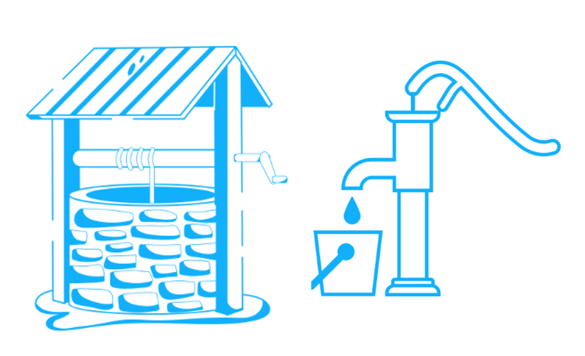
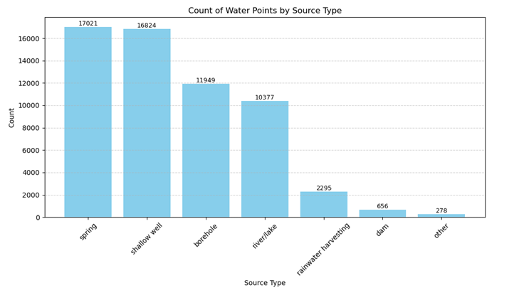
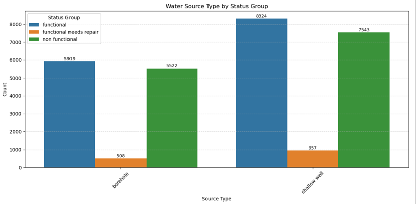
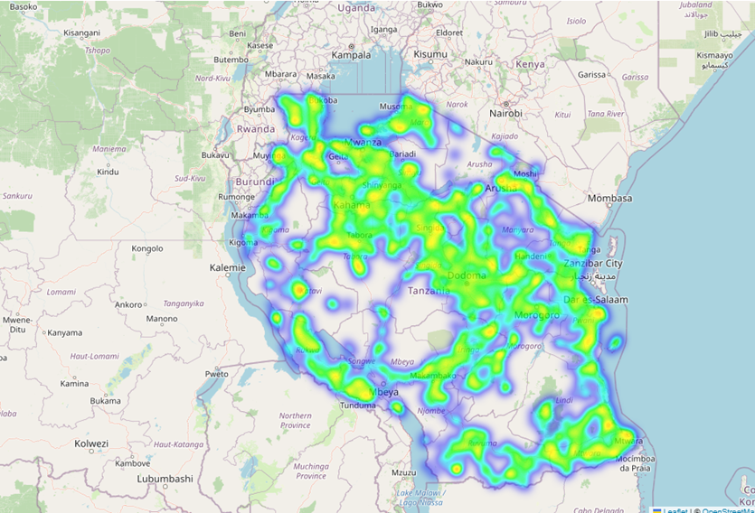
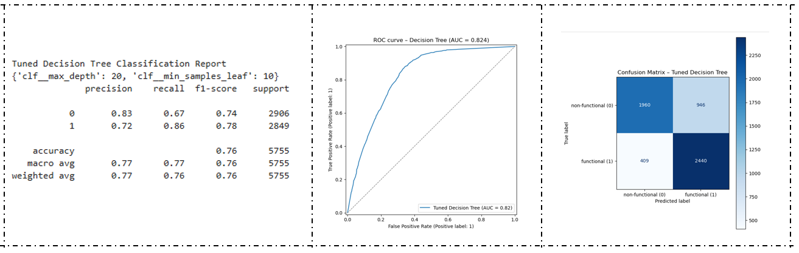
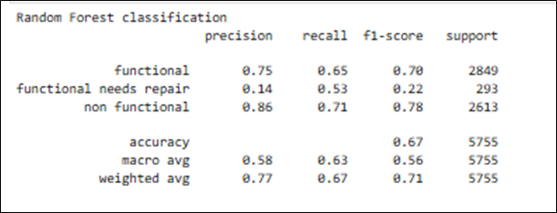
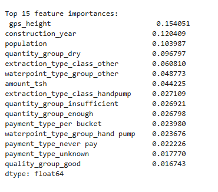

# Tanzanian Water Wells  

# Business Understanding  

* Tanzania is one of the countries located in East Africa and has a population of over 67 million. Most people live in rural areas, and the population is largely young.  
* A critical concern is limited access to clean water, especially in rural areas where water sources are scarce or polluted. This impacts health, agriculture, and education, particularly for women and children who collect water daily.  
* Tanzania Development Vision 2025 which aspires to achieve universal access to water supply in urban areas and ensuring 90% water supply coverage in rural areas by 2025.  
* In Tanzania, the current average water supply coverage in urban and rural areas is 78% and 59.76%, respectively. The major water sources include Lake Victoria, Lake Tanganyika, rivers like the Rufiji, underground aquifers, and wells both shallow and deep.  
* However, access is challenged by seasonal variability, pollution, overuse, and inadequate infrastructure. In rural areas, many depend on wells, which often face issues like contamination, drying, and poor maintenance.  

## Problem statement  
* In Tanzania, a larger proportion of its citizenry relies of water wells as key source of water. Such sources are prone to contamination, drying, and poor maintenance. Therefore, it requires monitoring for water levels, quality and even maintenance.   
* The Tanzanian water wells dataset provides a comprehensive information for approximately over 59,000 water wells with necessary features providing information related to pump, installation, location and condition related.   
* As government in collaboration with sector stakeholders (NGOs, private actors) put measures to achieve universal access to water supply in urban areas and ensuring 90% water supply coverage in rural areas by 2025.   
* It is prudent to identify where to invest scarce resources and achieve optimal impact utilizing the available information. The task at hand involves finding a scientific approach that can provide information on which waterpoints (water wells) will likely fail and thus better plan accordingly for operational maintenance.

### Stakeholders  
1. The Tanzanian government and its Agencies (Ministry of Water and Irrigation)
2. Non-Governmental Organizations
3. Private Actors

### Objectives  
The overall objective is to build a predictive model that classifies the operational status of water wells based on attributes provided in the Tanzanian Water Wells dataset. To realize this, the following specific objectives are introduced.   
1. To identify factors influencing the functionality of the wells  
2. Develop models for predicting the functionality of the water wells  
3. To evaluate the models and identify the significant features for determining wells functionality   
4. Use the optimal model to predict test  data  

#### Metrics for Model Evaluation 
To evaluate the performance of the models, the following metrics will be considered  
1. Accuracy - *Measure overall correctedness* 
2. Precision - *Measures the purity of the positive predictions: the proportion of items the model labelled as positive that are actually positive (TP / (TP + FP)*
3. Recall - *Measures the completeness of the positive class: the proportion of all true positives the model successfully recovered (TP / (TP + FN))*
4. Confusion matrix - *Visualize performance per class by showing true and predicted values*
5. ROC - AUC - *Evaluates ability to distinguish classes*

## Data Understanding
The Tanzanian Water Wells dataset available for this problem are as follows
1. Training_set_values - The file contains 40 features(predictors) that will be used to train the model. 
2. Training_set_labels - The file contains the target variable that we will be exploring its prediction. It captures the operational status of the waterpoint and has three categories (functional, non-functional, and functional needs repair).
3. Test_set_values - This has similar features (40) as the Training_set_values file. It will be used for generating predictions after training the model

### Data Processing and Cleaning
Data set was processed by undertaking the following processes
* Data merging
* Duplicates checking and dropping
* Data reduction
* Visualiziation
* Selection of features by inspection
* Data Cleaning and imputation
* Saving of final dataset

#### Some visualizations

The bar plot of water points by source type we observe that in Tanzania, Springs (17,021) are the main source of water followed by shallow wells (16,829) and boreholes (11,949), river/lakes, rainwater harvesting, dam and others in that order. 
Wells are Man-made hole dug or drilled into the ground and require pumping or drawing manually to draw the water.

From the bar plot, water wells data indicates three functionality status. The functional and non-functional water wells are nearly equal. However functional wells requiring repairs are significantly lower (under a thousand) for both categories.

## Findings

#### Binary Models
Two models that consider a binary output variable (status group) were explored; That is **Model 2: Logistic regression** and **Model 3: Decision Tree**

*The tuned Model tree - Decision Tree outperforms the Model 2- Logistic model owing to the following factors*
* Accuracy rises from 0.74 to 0.76 and macro‑F1 from 0.74 to 0.76, thus mainly captures more non‑functional wells (recall 0.67 vs 0.59) while keeping high precision (0.83).
* Functional well recall dips slightly (0.86 vs 0.90) but gains precision (0.72 vs 0.68), producing a better class balance.
* Logistic regression still offers smoother probability ranking (ROC‑AUC 0.802) and simpler interpretation, but the tree’s richer splits deliver superior overall field usefulness in practice.

#### Multi-Class models
Three models were explored while keeping all categories of the status group variable; i.e the case of multi-calss predictive modelling. The models employed included **Model 1: Logistic regression**, **Model 4: Decision Tree** (including pruned) and **Model 5: Random Forest**  

* The Model 5 – Random Forest performs the best overall. It achieves the highest accuracy (0.67), macro average F1-score (0.63), and weighted average F1-score (0.71). It balances precision and recall well across all classes, especially handling the minority class "functional needs repair" better than others.
* Compared to logistic regression and decision trees, Random Forest shows improved generalization and classification performance, making it the most reliable model here.

#### Features importance
1. The most influential features in the Random Forest model are primarily numeric, with *gps_height*, *construction_year*, and *population* standing out as the top three.  
     * *gps_height* contributes the most, suggesting that elevation plays a key role in determining pump functionality of a water well, perhaps due to its influence on water pressure or accessibility.
     * *Construction_year* highlights the relevance of infrastructure age, implying older pumps are more likely to need repair.
     * The *population* emphasizes usage demand, with higher population may lead to faster wear or increased strain on the system.  

2. Also, categorical features  play a significant role, particularly in representing the condition, type, and usage of the water point.   
     * Features like *quantity_group_dry*, *extraction_type_class_other*, and *waterpoint_type_group_other* indicate that specific categories of water availability and extraction methods are strong signals of functionality of a water well.
     * Additionally, payment-related features such as *payment_type_never pay* and *payment_type_unknown* suggest that financial commitment and maintenance responsibility might influence whether a pump remains in working order.

3. Overall, the random forest model benefits from a diverse set of features both numeric and categorical which together provide a comprehensive picture of the factors affecting water pump performance.
     * The emphasis on both physical characteristics (like elevation and construction year) and socio-economic indicators (such as payment type and extraction method) reflects a balanced model that can make nuanced predictions. This insight can guide not only predictive modeling but also resource allocation for maintenance and infrastructure planning.

## Conclusions and Recommendations

1. To determine Water Well (Shallow well and boreholes) by functionality and non-functionality, explore use of tuned Decision tree model. 

2. To determine water well (Shallow well and boreholes) by all the thethree status groups, explore use of random forest.

3. The most important features in determining effective predictive model were elevation, costruction year, population using the source, water availability and extraction methods, financial commitments and maintenance responsibility.

4. To further improve of predictive models, take next steps to explore fine tuning approaches of the optimal model - Random Forest.

